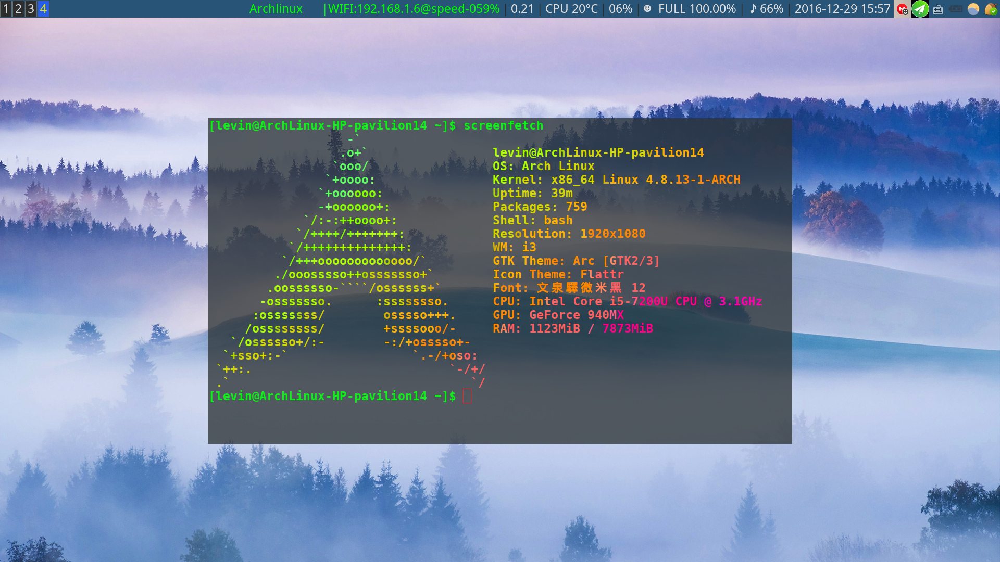

**i3wm配置**
---

# 使用
## 安装
安装i3wm，一般包名叫做**i3**，包含i3-wm，i3lock和i3status。

下载本配置文件并解压，将i3目录和i3status放于**~/.config/目录**，将Pictures（几张示例壁纸）放于当前用户家目录下（即~/下）即可。

## 需要的软件
- feh        设置壁纸需要。！！！（最好安上）
- 适合的终端（参照下文配置-终端）！！！
其余选择性安装：
- mate-power-manager或xfce4-power-manager或其他电源管理软件。如果方便调整亮度。！
- xcompmgr     如果需要终端透明。！！
- scrot     截屏。本配置默认使用的截屏快捷键调用的此工具，当然也可以使用其他工具。
- alsa-utils    一般都安上了。！

# 配置
关于本配置的一些重要说明。
## 按键
此配置文件的自定义常用按键说明，i3wm的默认按键以及按键设置请参阅相关文档或查看config文件。

在默认配置上稍作了修改，参照windows下的常用快捷键和vim按键习惯。

$mod key使用的默认的Mod4，**一般指的是**windows键或super键或meta键。

- 截图：`$mod+PrtSc`（配置里绑定的是scrot截屏工具，**需要安装scrot**，PrtSc即PrintScreen键，参考的windwos下的截屏快捷键）。

- 文件管理器：`$mod+e`（配置里使用的lxde桌面pcmanfm文件管理器，小巧依赖少功能齐全，须安装pcmanfm，当然也可以使用其他管理器，须修改按键配置，参考windows的文件管理器快捷键，e-explore）。

- 关闭窗口：`Alt+F4`（Alt一般是mod1键，参考windows的关闭窗口快捷键）。
- 隐藏和再现窗口：`$mod+minus`和`mod+plus`（minus即是减号所在键，plus即是加号所在键）。

- 调整窗口边框风格：
	- `$mod+n`有边框（就是一般的风格，有边框有顶部栏，n-normal）。
	- `$mod+u`无边框（本配置默认风格，打开新窗口也不会有边框，可自行设置，u-unnormal）。

	- `$mod+o`1像素边框（o-one pixel）。
	- `$mod+b`可在上面三种风格来回切换（b-border style）。
	
- 视窗焦点切换：
	`$mod+Shift+`h/j/k/l或者**上下左右箭头**（可以切换当前焦点，模仿vim）。
	
- 移动当前窗口：
	`$mod+`h/j/k/l**或者上下左右箭头**（可以将当前的窗口即焦点窗口向指定方向切换，模仿vim）。
	
- 分隔窗口：
	- `$mod+v`上下分割（i3wm默认，v-vertical）。
	- `$mod+Shift+h`左右分割（左右分割，默认风格就是左右分割）。
	
- 窗口布局风格：
	- `$mod+s`堆叠式（s-stacking）。
	- `$mod+t`标签式（t-tab）。
	- `$mod+c`平铺式（默认风格），反复按下此快捷键可在上下分割平铺和左右分割平铺之间来回切换（c-change）。
	
- 相邻工作区切换:`$mod+tab`（后一个）或`alt+tab`（前一个）。

- 亮度和音量：
	`Fn+`笔记本的音量加减键（荧幕不会出现提示，可参看bar，也可以用终端的`alsamixer`调整，需要安装alsa-utils），加减亮度。
	
	`Fn+`笔记本的亮度加减键以及静音键（需要一个电源管理软件，推荐**mate-power-manager**），加减音量及静音。
	
## 壁纸和锁屏
壁纸图片放置路径是～/Pictures/wallpaper/wallpaper.jpg，不过本配置文件默认使用下文所述的随机壁纸实现方法，具体参看下文**随机壁纸**。

锁屏图片路径是~/Pictures/wallpaper/lock/lock.jpg。

需要安装**feh**！

*建议用一个固定的路径设置壁纸或锁屏，需要更换壁纸的时候将新图片命名位wallpaper放进去覆盖即可，比较方便（当然要注意后缀名是否一致）。*

### 随机壁纸
本配置**默认**使用一个wallpaper.sh的脚本随机更换壁纸。
将需要设定的壁纸放置到~/Pictures/wallpaper/目录下即可（如需更换壁纸路径，请在i3/config文件中根据注释说明更改）。

如需要使用固定壁纸，在**i3/config**中取消“设定壁纸图片”的命令的注释，并注释掉“自动更换壁纸”的命令。

**注意**
～/.config/i3/wallpaper.sh文件需要有可执行权限，如壁纸加载出问题，执行：
`chmod +x ～/.config/i3/wallpaper.sh`
给予执行权限。

可参考[archwiki-feh](https://wiki.archlinux.org/index.php/Feh_(%E7%AE%80%E4%BD%93%E4%B8%AD%E6%96%87))

## 电源管理
`$mod+alt+l`锁屏。

锁屏图片设置见上面的说明。

灭屏时间设置示例：
`exec --no-startup-id xset dpms 300`

300即是300秒，根据需要修改。

锁屏/关机/重启/退出：按下`mod+Shift+q`或会提示选择，接下来----

按下L锁屏（lock）、e退出（exit）、r重启（reboot）和p关机（poweroff）。

（mod+Shift+q本来是i3wm的默认关闭窗口键）

## 终端

配置中使用了xcompmgr这个工具来配合终端设置透明，需要安装**xcompmgr**。

最好使用下面的终端之一。
>因为按 $mod+Return, 便会启动 i3-sensible-terminal, 即执行虚拟终端的脚本。它会试图按以下顺序一一执行，直到成功启动某虚拟终端： 
- urxvt
- rxvt
- terminator
- EtermAUR
- atermAUR
- xterm
- gnome-terminal
- roxterm
- xfce4-terminal

参考自[archlinux-wiki:i3wm-虚拟终端](https://wiki.archlinux.org/index.php/I3_(%E7%AE%80%E4%BD%93%E4%B8%AD%E6%96%87)#.E8.99.9A.E6.8B.9F.E7.BB.88.E7.AB.AF)

用其他的终端需要在配置中设置。推荐选择可以设置透明度的终端，推荐roxterm、xfce-terminal、gnome-terminal和terminator，设置简单。

## 托盘图标
bar上某些要显示托盘图标（tray icon），须执行xrandr--output，在i3wm配置文件添加类似语句：

`exec --no-startup-id xrandr --output eDP1 --primary`

其中eDP1是我的计算机的显示设备的名字。查看计算机显示设备名称的命令：

`xrandr`

例如我的显示内容有：

`
xrandr
Screen 0: minimum 8 x 8, current 1920 x 1080, maximum 32767 x 32767
eDP1 connected 1920x1080+0+0 (normal left inverted right x axis y axis) 310mm x 170mm
`

其中的eDP1便是我的显示设备名称。

---

注意：
更改了配置文件需要重新加载或重新启动i3方能生效（按下$Mod+Shift+s或者$Mod+Shift+r，分别为restart和reload）

---

其余参考config内注释和i3wm相关文档说明。

i3wm使用参考：

[i3wm官方文档](http://i3wm.org/docs/)

[ArchLinux-wiki:i3wm（简体中文）](https://wiki.archlinux.org/index.php/I3_(%E7%AE%80%E4%BD%93%E4%B8%AD%E6%96%87))

[DeepinLinux-wiki:i3](https://wiki.deepin.org/?title=I3)

